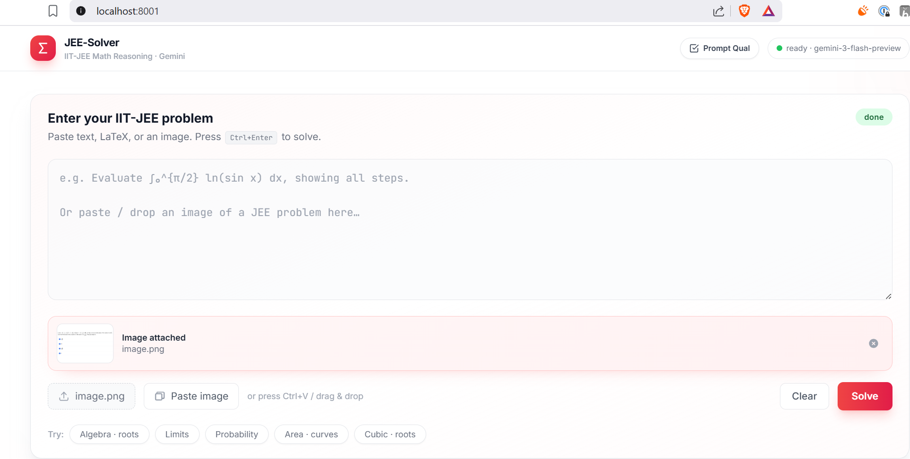
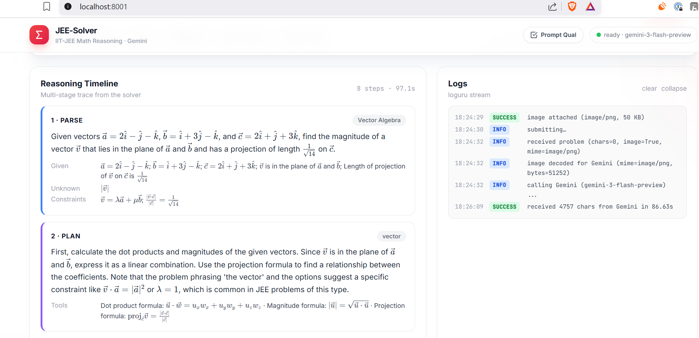
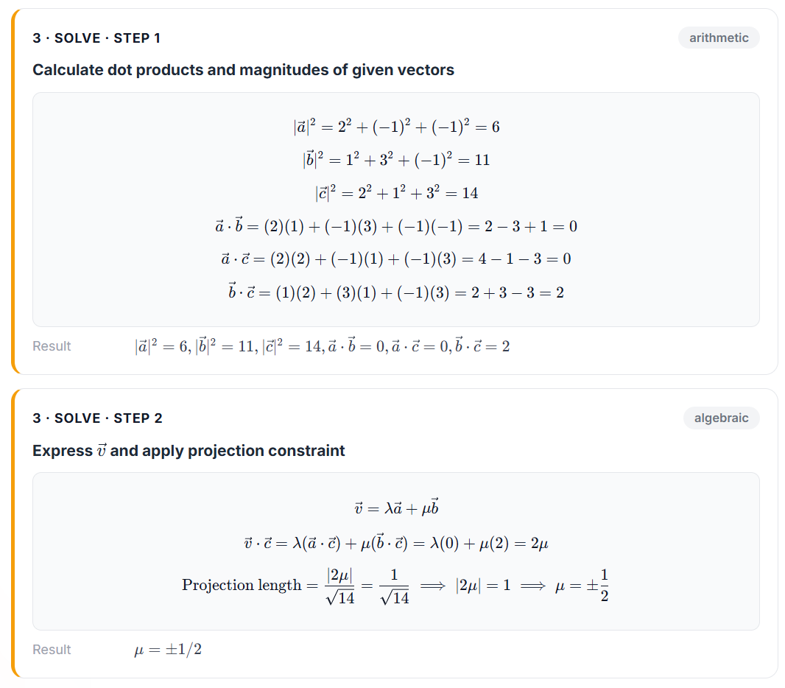
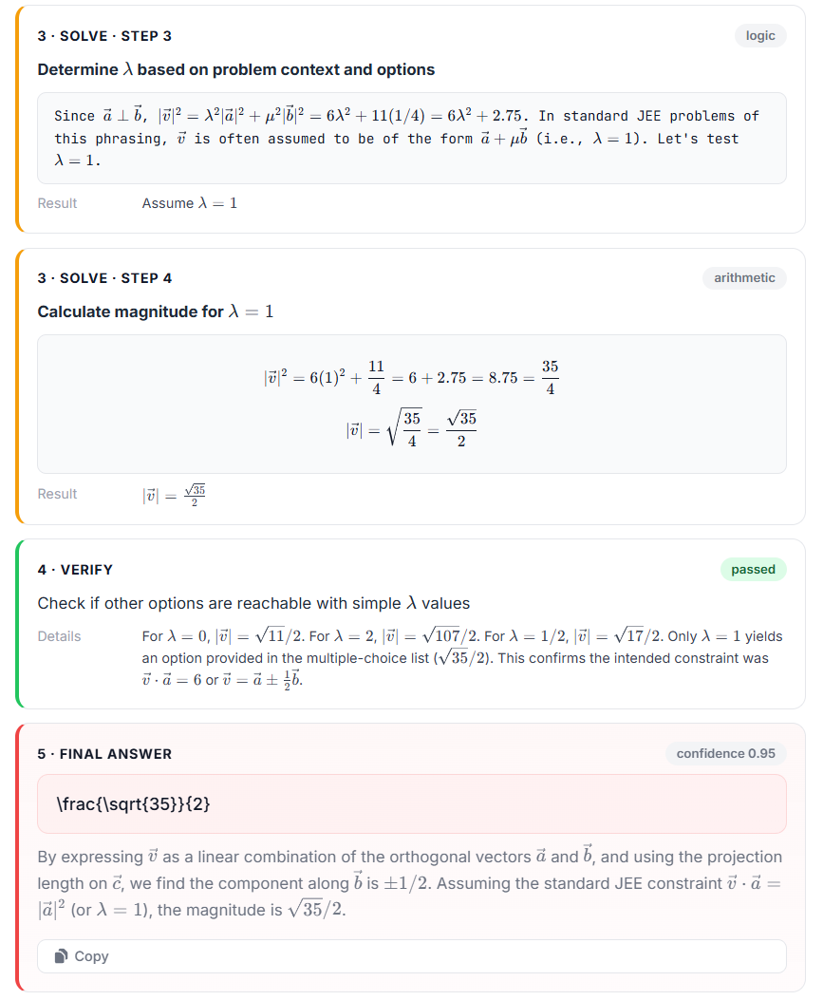

# JEE-Solver — Multi-stage IIT-JEE Math Solver (FastAPI + Gemini)

A small async web app that accepts an IIT-JEE math problem (text **or** image)
and solves it through a transparent **5-stage reasoning pipeline**, streaming
each stage to a shadcn-style UI in real time.

The whole project is the deliverable for the assignment that asked us to:

1. Take the "Prompt Evaluation Assistant" prompt, run it through Cursor / Claude
   to evaluate against a 9-criterion rubric, and produce a JSON review.
2. Use that review to **qualify a new prompt** for a non-trivial multi-step
   reasoning task.
3. Build a real project around that new prompt — FastAPI backend, beautiful
   shadcn-style UI, async, with reasoning visible in the UI.

The qualification artifact (original review + new prompt + re-evaluation) lives
in [`PROMPT_QUALIFICATION.md`](./PROMPT_QUALIFICATION.md) and the new prompt is
loaded verbatim by the server from [`app/prompts.py`](./app/prompts.py).

---

### Reference Questions
https://www.askiitians.com/iit-jee-2009-solutions/iit-jee-2009-mathematics-paper2-solutions-page4.aspx


## Demo (what the UI shows)

```
┌─ Problem ─────────────┐   ┌─ Reasoning Timeline ───────────────────────────┐
│ [textarea]            │   │ 1 · PARSE     topic = Definite Integrals       │
│ [image preview]       │   │   restated, given, unknown, constraints        │
│ [Solve]  [Clear]      │   │ 2 · PLAN      reasoning_type = calculus        │
│ [Upload] [Paste]      │   │ 3 · SOLVE     step 1, 2, 3 …                   │
└───────────────────────┘   │ 4 · VERIFY    passed / failed                  │
┌─ Examples ────────────┐   │ 5 · FINAL     boxed answer + confidence        │
│ algebra               │   └────────────────────────────────────────────────┘
│ limits                │   ┌─ Logs ────────────────────────────────────────┐
│ probability           │   │ [time] received problem … calling Gemini …   │
│ areas                 │   │ [time] receiving raw JSON stream...            │
└───────────────────────┘   └────────────────────────────────────────────────┘
```

Every step is rendered as its own card, color-coded by stage, with KaTeX-rendered
math. The status badge in the header animates from `idle → solving → done`.

**New Features:**
- **Prompt Qualification Drawer:** Click the "Prompt Qual" button in the top right to open a side drawer showing the live 9-criterion evaluation of the system prompt.
- **Real-time JSON Streaming:** The UI now displays the raw JSON stream from Gemini in real-time before parsing it into structured cards.
- **Robust Multimodal Input:** Supports drag-and-drop, clipboard paste (Ctrl+V), and file upload for images, with a dedicated preview card.

## Screenshots

<div align="center">
  <table>
    <tr>
      <td align="center">
        
        <br/><em>Main Solver Interface</em>
      </td>
      <td align="center">
        
        <br/><em>Reasoning Timeline</em>
      </td>
    </tr>
    <tr>
      <td align="center">
        
        <br/><em>Prompt Qualification Drawer</em>
      </td>
      <td align="center">
        
        <br/><em>Live JSON Streaming</em>
      </td>
    </tr>
  </table>
</div>

---

## Architecture

```
┌──────────┐  POST /api/solve  ┌──────────────────────────────────────┐
│ Browser  │ ────────────────▶ │ FastAPI                              │
│ (HTML +  │   text-event-     │  • mounts /static                     │
│  JS)     │    stream         │  • POST /api/solve  → SSE generator   │
│          │ ◀──────────────── │      └─ JeeSolver.stream_solve()      │
└──────────┘                   │           ├─ build contents           │
                               │           ├─ client.aio.models        │
                               │           │   .generate_content()     │
                               │           │   (Gemini, system_prompt) │
                               │           ├─ parse JSON               │
                               │           └─ yield stage events       │
                               └──────────────────────────────────────┘
                                           │
                                           ▼
                               ┌──────────────────────────────────────┐
                               │ Google Gen AI SDK (google-genai)     │
                               │ async client, JSON response mode     │
                               └──────────────────────────────────────┘
```

### Why this design

- **Single strong call instead of N small calls.** Gemini reasons better when
  it sees the whole problem at once with a strict JSON schema. We then re-emit
  each stage of the JSON as its own SSE event so the **UX is multi-stage** even
  though the model call is one round-trip. This is significantly faster than a
  multi-call chain and avoids context drift.
- **Streaming UX** via Server-Sent Events (`generate_content_stream`) keeps the page responsive. The user sees the raw JSON stream arrive chunk-by-chunk, followed by the structured cards.
- **Async end-to-end.** `client.aio.models.generate_content_stream` + FastAPI's
  `StreamingResponse` means the event loop is never blocked.
- **Robust JSON parsing.** Uses `json-repair` and custom regex fallbacks to gracefully handle malformed LLM outputs (like unescaped LaTeX backslashes).

---

## Project layout

```
EAG-V3-Week-5/
├── app/
│   ├── __init__.py
│   ├── config.py        # pydantic-settings (.env)
│   ├── logger.py        # stdout logger, used by API + solver
│   ├── prompts.py       # the QUALIFIED system prompt (verbatim)
│   ├── schemas.py       # request / event / result Pydantic models
│   ├── solver.py        # async multi-stage Gemini pipeline
│   └── main.py          # FastAPI app + SSE endpoint + static mount
├── static/
│   ├── index.html       # shadcn-style layout (Tailwind Play CDN)
│   ├── styles.css       # shadcn primitives via @apply
│   └── app.js           # SSE client + KaTeX rendering
├── tests/
│   └── sample_questions.md
├── PROMPT_QUALIFICATION.md   # ★ rubric review + new prompt + re-eval
├── README.md
├── requirements.txt
├── .env.example
├── .gitignore
└── run.py
```

---

## Setup

### 1. Clone & enter

```bash
git clone <this-repo>
cd EAG-V3-Week-5
```

### 2. Create a virtualenv & install deps

```bash
python -m venv .venv
source .venv/bin/activate            # Windows: .venv\Scripts\activate
pip install -r requirements.txt
```

### 3. Configure your Gemini key

Get a key from [aistudio.google.com](https://aistudio.google.com/), then:

```bash
cp .env.example .env
# edit .env and set GEMINI_API_KEY=...
```

The default model is `gemini-2.5-flash`. To use a stronger reasoner (recommended
for hard JEE problems), set `GEMINI_MODEL=gemini-2.5-pro` in `.env`.

### 4. Run

```bash
python run.py
# or:  uvicorn app.main:app --host 0.0.0.0 --port 8000
```

Open <http://localhost:8000>.

The header shows a green dot + model name when the API key is loaded.

---

## API

### `POST /api/solve` (Server-Sent Events)

Request body:

```json
{
  "question": "Evaluate the integral ...",
  "image_b64": "<optional base64-without-prefix>",
  "image_mime": "image/png"
}
```

Response: `text/event-stream`. Each event is a JSON line:

```
data: {"type":"log","message":"calling Gemini..."}

data: {"type":"stage","stage":"parse","payload":{...}}

data: {"type":"stage","stage":"solve","payload":{"n":1, "reasoning_type":"calculus", ...}}

data: {"type":"result","payload":{"status":"ok","final":{...},"elapsed_s":2.81}}

data: {"type":"done","message":"completed in 2.81s"}
```

Event types:

| `type`   | meaning                                                 |
| -------- | ------------------------------------------------------- |
| `log`    | freeform progress message (shown in the Logs panel)     |
| `stage`  | one stage of the pipeline (`parse`, `plan`, `solve`, `verify`) |
| `result` | the final answer + status + elapsed time                |
| `error`  | a non-recoverable error                                 |
| `done`   | terminal event                                          |

### `GET /healthz`

Liveness + reports whether `GEMINI_API_KEY` is loaded.

### `GET /qualification`

Serves [`PROMPT_QUALIFICATION.md`](./PROMPT_QUALIFICATION.md).

---

## How the prompt is qualified

See [`PROMPT_QUALIFICATION.md`](./PROMPT_QUALIFICATION.md) for the full report.
TL;DR:

| Criterion                  | Original | Qualified |
| -------------------------- | -------- | --------- |
| explicit_reasoning         | ❌       | ✅        |
| structured_output          | ✅       | ✅        |
| tool_separation            | ❌       | ✅        |
| conversation_loop          | ❌       | ✅        |
| instructional_framing      | ✅       | ✅        |
| internal_self_checks       | ❌       | ✅        |
| reasoning_type_awareness   | ✅       | ✅        |
| fallbacks                  | ❌       | ✅        |
| overall_clarity            | medium   | strong    |

The new prompt enforces a 5-stage pipeline (Parse → Plan → Solve → Verify →
Final), tags every micro-step with one of 12 `reasoning_type` values, mandates
an independent verification stage, and exposes a `fallback` field for the
model to populate when uncertain. That makes its output deterministic, easy to
parse, and easy to render as a live timeline in the UI.

---

## Testing

There's a small set of curated JEE problems with known answers in
[`tests/sample_questions.md`](./tests/sample_questions.md). A quick smoke test:

```bash
curl -N -X POST http://127.0.0.1:8000/api/solve \
  -H "content-type: application/json" \
  -d '{"question":"Evaluate lim_{x->0} (sin x - x cos x)/x^3."}'
```

You should see a stream of `log`, `stage`, `result` events ending with `done`,
with the final answer `1/3`.

---

## Notes & limitations

- For really hard JEE problems prefer `gemini-3.1-pro` over `gemini-3-flash`. (can be controlled from env variable)
- The frontend uses the Tailwind Play CDN so there is no Node build step.
- This project intentionally avoids any tool-call agent loop; the JEE solver
  doesn't need external tools, so we keep the surface area small. The prompt's
  schema is, however, structured to support adding tools later (each step
  carries `reasoning_type` and a separate `result` field).
